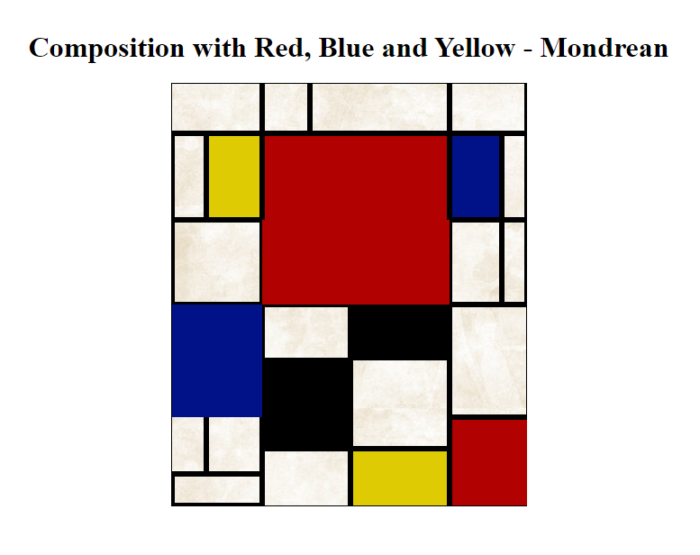

# Ejercicio de GRID cuadro Mondrean

### Explicación:
Me propuse el reto de crear con GRID el cuadro Composition with red, blue and yellow, del pintor holandés Mondrean.

### Herramientas utilizadas:
* HTML5
* CSS3
    * Grid

